Discovery 套件  
============================================

    Discovery 套件是基于 Arduino UNO 开发的编程套件，其由主控，连接线，以及按键组，电位器，蜂鸣器，RGB-LED，温湿度传感器，超声波测距传感器，电机风扇等模块组成。可以进行图形化编程或通过Arduino IDE进行代码编程。
 
    
简介
******************** 
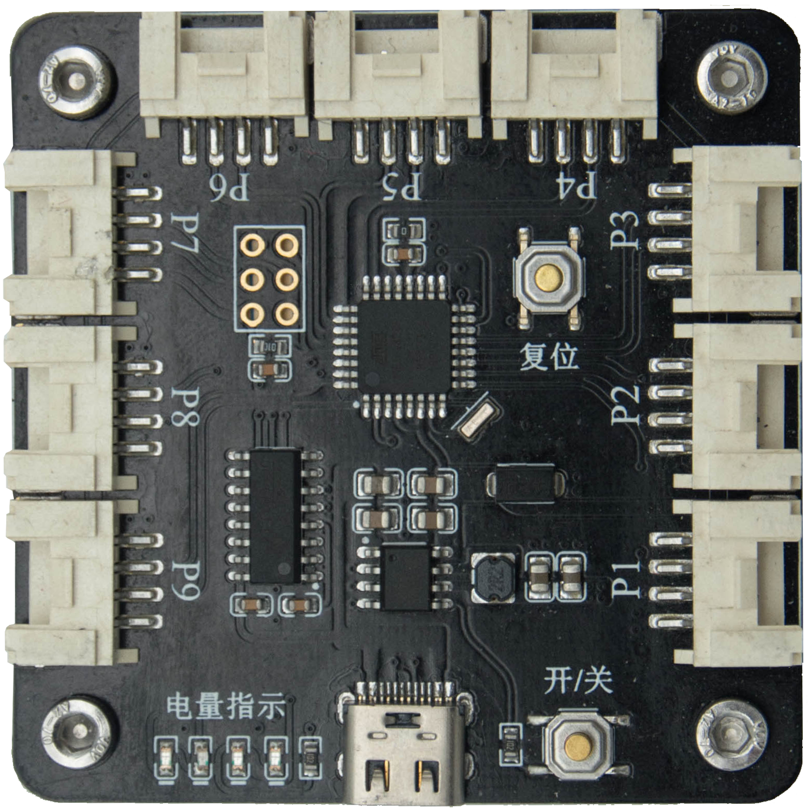
   
* 供电方式：USB TypeC（DC: 5V）
* 微处理器: Atmega328P-AU，兼容Arduino UNO系统，主频:16MHz 
* 存储：Flash:32KB，EEPROM:1KB
* 按键：电源键：单击打开电源，双击关闭电源；复位键：单击复位系统
* 电量指示：4个指示灯用于指示主控板系统电量，共5种显示状态，分别表示电量为：0%，25%，50%，75%，100%。
* 输入/输出端口：9个输入/输出端口，接口物理类型为HY2.0-4P，其中端口4、5、6为数字/模拟信号端口，端口1、2、3、7、8、9为带PWM的数字信号端口，端口6为硬件I2C接口。
.. Note:: 系统负载电流持续小于45mA，32秒后将自动关断电源。

--------------------

入门使用
********************

点击下载
\ `相关资料 <https://pan.baidu.com/s/1Poc3n607VHI5KOrWGQ2K3Q>`_ 
提取码：5nqa 。
 
1. 驱动安装
++++++++++++++++++++++
主控板通过 USB 连接电脑通信，因此需要安装驱动 USB 转 UART 串口驱动。

进入资料下载链接，选择下载驱动。双击打开“CH341SER.EXE”文件，点击“安装”。若提示安装失败，则先点击“卸载”，再点击“安装”按钮。

安装驱动后，将鼠标移动到我的电脑，右键属性-->设备管理器-->端口(COM和LPT)，可查看到设备连接信息，如下图所示：

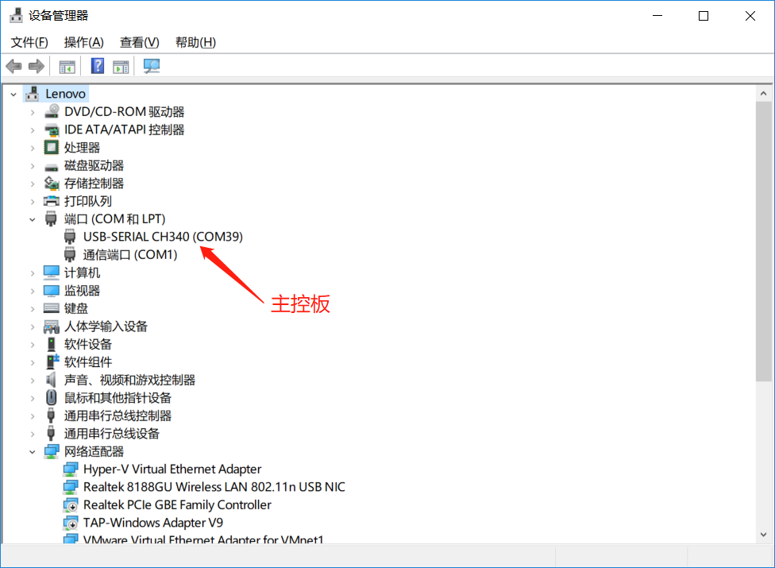

 
2. 软件使用
++++++++++++++++++++++
 
软件界面介绍

.. figure:: 软件界面介绍.png      
   
3. 案例测试
++++++++++++++++++++++
模块测试案例在软件安装包的下图所示路径中

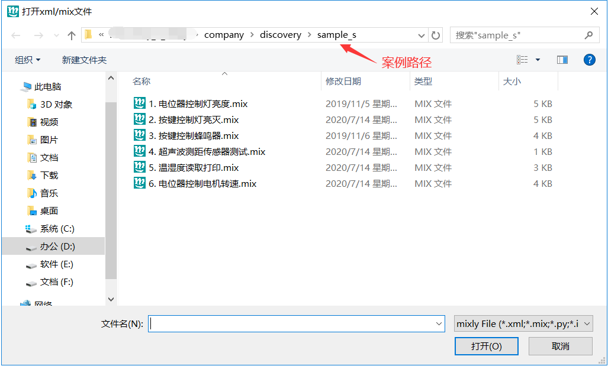

如下图所示，点击“打开”按钮，选择任一案例打开；点击“COMxx”下拉选择端口（不选择COM1）；点击“上传”按钮；观察下边信息输出，等待程序上传完成。

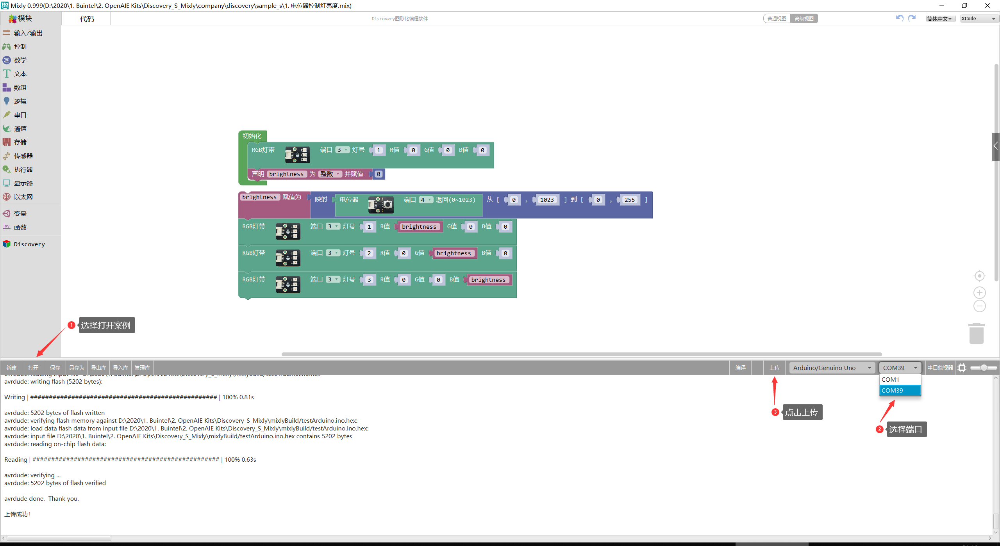

.. Note:: 图片较小，无法看清时，可以把鼠标停留在图片所处位置右键选择“在新标签页中打开图片”。

4. 串口监视器使用 
++++++++++++++++++++++
串口监视器

--------------------

套件模块使用教程 
********************

1. RGB-LED
++++++++++++++++++++++

物理接口：PH2.0-4P母座；通信接口类型：单总线。

概述：RGB灯带含三个RGB（Red-红，Green-绿，Blue-蓝）可调光LED，其内部带控制芯片，每个灯可独立控制。每个灯可发出红绿蓝三种颜色（即光学三原色），256种不同亮度的光。

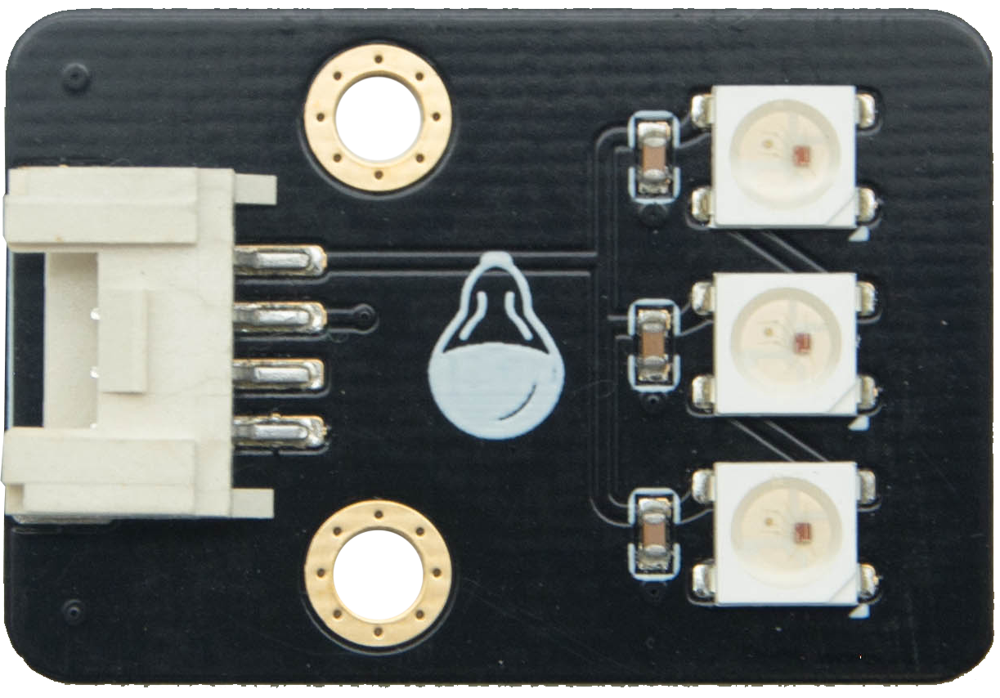
   
.. Note:: 每种颜色的LED共有2^8=256(0~255)个发光等级，即共有2^8^3=16 777 216种颜色组合。通过查找 \ `RGB颜色对照表 <https://tool.oschina.net/commons?type=3>`_ 生成自己喜欢的颜色。

示例：点亮灯

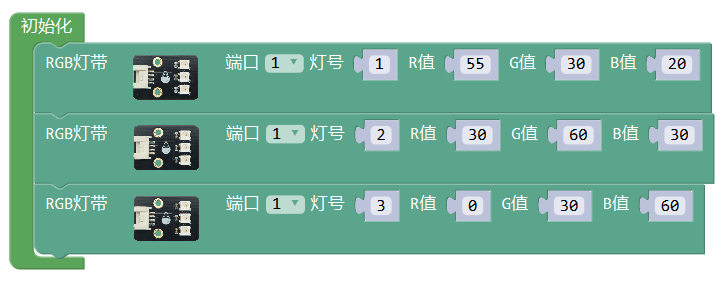
   
2. 按键组
++++++++++++++++++++++
物理接口：PH2.0-4P母座。输出TTL电平信号。

概述：按键组含按键“1”和按键“2”，与模块上字符标注对应。按键输出信号带上拉电阻，按键按下时接地输出低电平信号，弹起时输出高电平信号。
 
.. figure:: discovery_key_group.png  
   :width: 230px
   :align: center
    
示例：按键控制开关灯

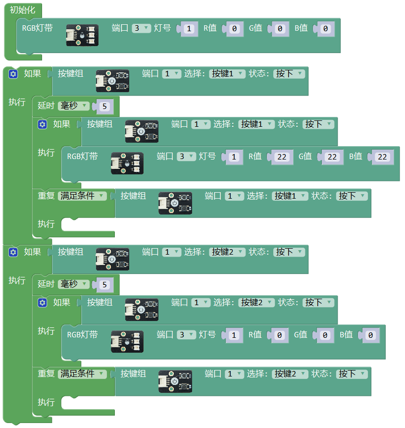
   
3. 电位器
++++++++++++++++++++++
物理接口：PH2.0-4P母座；输出模拟信号。

概述：电位器即可变点阻器，由固定阻值的电阻体与滑动系统组成，通过一个可滑动触点（作为信号输出端）在电阻上滑动，通过拧转旋钮可以调节信号输出端与电阻两端的电阻值。
下图电位器模块逆时针旋转时，接地端与信号输出端之间的电压变小，通过模数转换获得的输出数值将变小；顺时针旋转时，接地端与信号输出端之间的电压变大，通过模数转换获得的输出数值将变大。

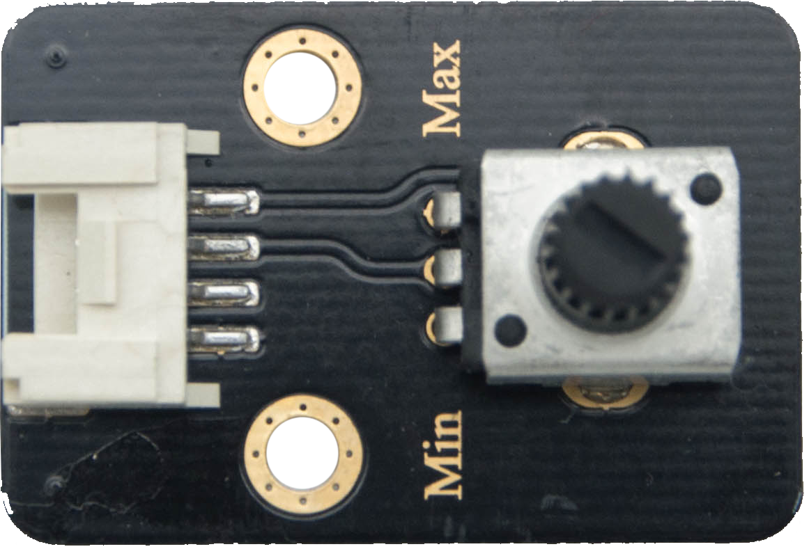
   
示例：电位器控制灯亮度

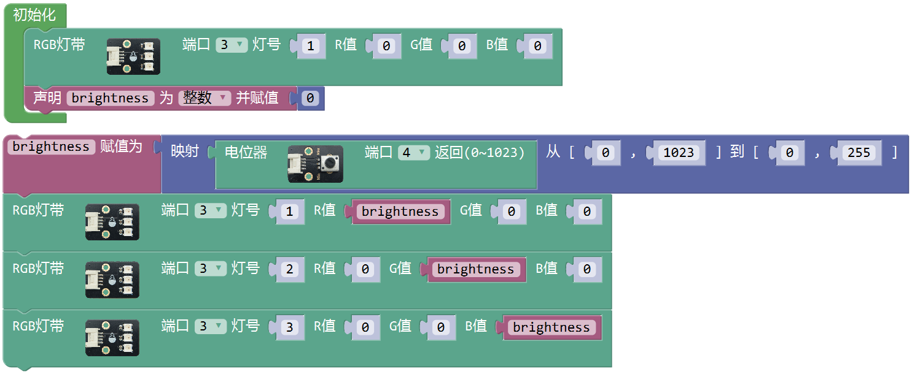
  
4. 蜂鸣器
++++++++++++++++++++++
物理接口：PH2.0-4P母座；

概述：无源蜂鸣器，通过电控振荡发声。 

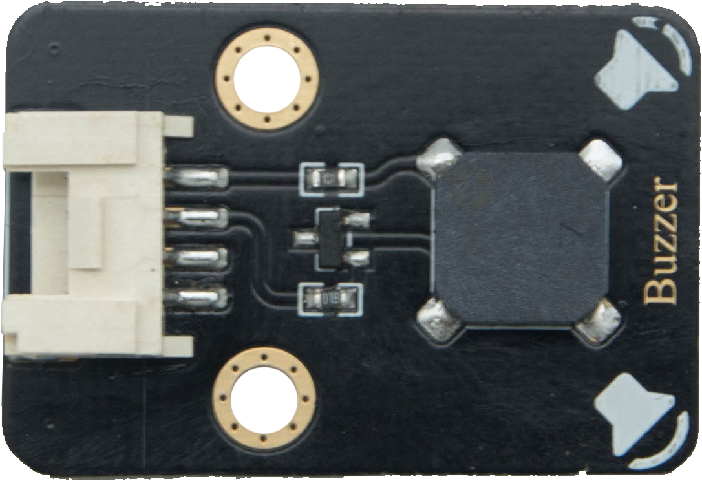
.. Note:: 频率一般设为100~1500之间，自行测试调节。

5. 温湿度传感器
++++++++++++++++++++++ 
物理接口：PH2.0-4P母座；通信接口类型：I2C

概述： 
温度测量范围：-40~80℃，分辨率：0.1℃，精度：±0.5℃，响应时间：小于5S；
湿度测量范围：0~99.9％RH（Relative Humidity，相对湿度），分辨率：0.1％RH，精度：±3％RH。
		
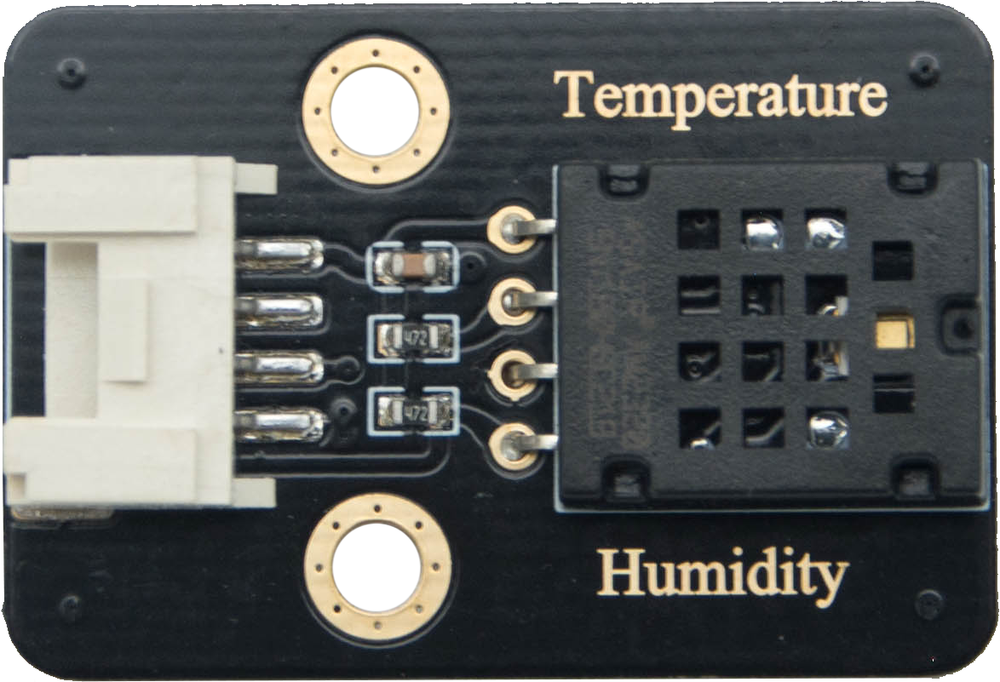

示例：温湿度读取显示

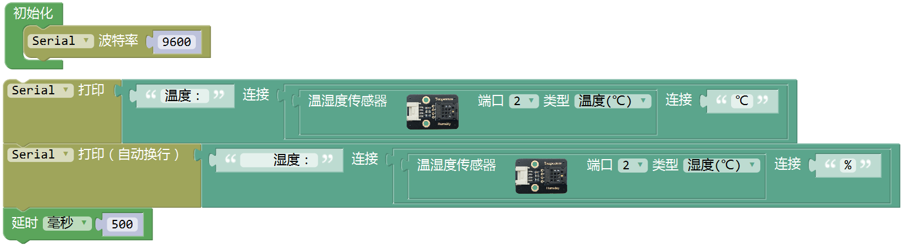
  
6. 超声波测距传感器
++++++++++++++++++++++ 
物理接口：PH2.0-4P母座；通信接口类型：I2C

概述：超声波测距传感器量程：0~400cm

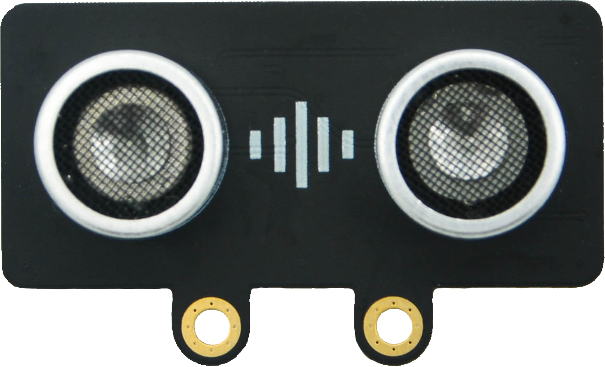
   
示例：超声波测距

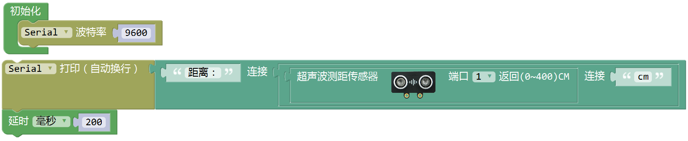
  

7. 电机风扇
++++++++++++++++++++++ 
物理接口：PH2.0-4P母座；通信接口类型：PWM

.. figure:: motor_fan.png  
   :width: 230px
   :align: center

示例：电机风扇转速控制

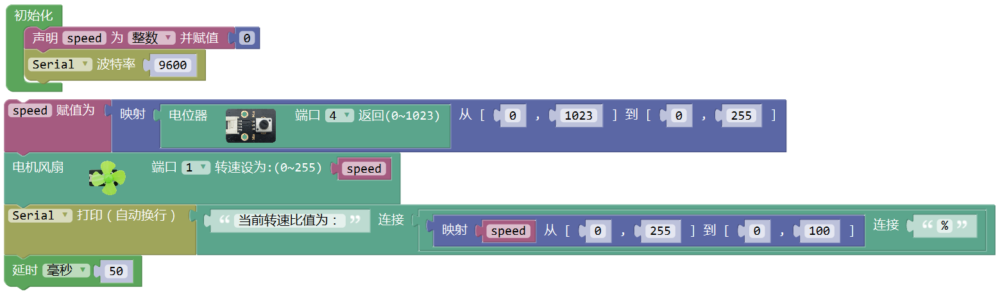

---------------------- 

 
 
 
 

 

 
